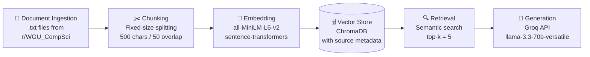

# Project 1 Planning: The Unofficial Guide

## Domain

**What domain I chose:**  
WGU CS Course Tips

**Why this knowledge is valuable:**  
Since WGU is an online degree program, the time required to complete a degree varies significantly from student to student. Therefore, it is important to independently gather useful information about each course before enrolling.

**Why finding this knowledge through official channels is difficult:**    
Information such as how long a course takes to complete, which courses are easier or more interesting, and which courses are best consecutively is largely based on personal experience and individual preferences. Because these factors are subjective and cannot be measured objectively, the university does not provide official data on them.

---

## Documents

| # | Source | Description | URL or location |
|---|--------|-------------|-----------------|
| 1 |r/WGU_CompSci |BSCS completed in 3 terms  |https://www.reddit.com/r/WGU_CompSci/comments/1j1lea2/finished_in_3_terms15_months_and_job_offer_before/|
| 2 |r/WGU_CompSci |C950 Data Structures & Algorithms II - passed post |https://www.reddit.com/r/WGU_CompSci/comments/1bdf53t/c950_data_structures_and_algorithms_ii_finished/ |
| 3 |r/WGU_CompSci |D427 passed - tips and experience |https://www.reddit.com/r/WGU_CompSci/comments/1qv9i0u/just_passed_d427_my_thoughts/ |
| 4 |r/WGU_CompSci |First WGU course passed - Practical Applications |https://www.reddit.com/r/WGU_CompSci/comments/1imkzu5/passed_my_first_wgu_course_practical_applications/ |
| 5 |r/WGU_CompSci |C952 passed - difficulty and study tips | https://www.reddit.com/r/WGU_CompSci/comments/1s9ewy3/i_defeated_the_beast_c952/|
| 6 |r/WGU_CompSci |D281 Linux Foundation passed with perfect score | https://www.reddit.com/r/WGU_CompSci/comments/1hp0jas/passed_d281_linux_foundation_with_a_perfect_score/|
| 7 |r/WGU_CompSci |D683 tips and discussion | https://www.reddit.com/r/WGU_CompSci/comments/1k4nutg/d683/|
| 8 |r/WGU_CompSci |D682 AI Optimization Task 1 guide | https://www.reddit.com/r/WGU_CompSci/comments/1mcwbq3/wgu_d682_guide_task_1_ai_optimization/|
| 9 |r/WGU_CompSci |D480 Software Design & QA passed | https://www.reddit.com/r/WGU_CompSci/comments/16c60nh/software_design_and_quality_assurance_d480_passed/|
| 10 |r/WGU_CompSci |D284 Software Engineering review and tips | https://www.reddit.com/r/WGU_CompSci/comments/1lfqoc3/d284_software_engineering_might_legitimately_make/|

---

## Chunking Strategy

**Chunk size:** 500 characters

**Overlap:** 50 characters

**Reasoning:**  
Each post contains short paragraphs covering different aspects of a course — difficulty, time spent, exam tips, and study resources. 500 characters is enough to capture one complete thought without merging unrelated topics into the same chunk.

---

## Retrieval Approach

**Embedding model:** all-MiniLM-L6-v2 via sentence-transformers

**Top-k:** 5

**Production tradeoff reflection:**
- **Accuracy:** all-MiniLM-L6-v2 is lightweight but may miss nuanced meaning in technical queries. A larger model like text-embedding-3-large would retrieve more relevant chunks.
- **Context length:** all-MiniLM-L6-v2 has a 256-token limit. For longer documents, a model with a larger context window would be needed.

---

## Evaluation Plan

| # | Question | Expected answer |
|---|----------|-----------------|
| 1 | How long does C950 typically take to complete? | About 20–30 hours |
| 2 | What resources do students recomment for passing C952? | Quizlets, webinar series |
| 3 | What study approach do students recommend? | complete all ZyBooks labs |
| 4 | Which courses are considered the most difficult? | C958 |
| 5 | What challenges do students face when completing D284? | Ambiguous requirements and inconsistent feedback |

---

## Anticipated Challenges

1. **Inconsistent documents:** Reddit posts vary widely in length and structure. Short or off-topic chunks may pollute retrieval results.

2. **Chunk boundary splits:** Key information may be split across two chunks. If neither chunk contains the full context, retrieval may return incomplete answers.

---

## Architecture

---

## AI Tool Plan

**AI Tool**  
Claude

**Milestone 3 — Ingestion and chunking:**  
I will provide Claude the chunking strategy section and request it to implement chunk_text() with my specified chunk size and overlap.

**Milestone 4 — Embedding and retrieval:**  
I will give Claude the retrieval approach section and ask it to implement an embed_and_store() function and retrieve() function that returns top-5 relevant chunks with source and distance score.

**Milestone 5 — Generation and interface:**  
I will give Claude the grounding requirement and ask it to implement a Groq API call with a prompt template that enforces context-only answers, and a Gradio interface with question input, answer output, and source display.